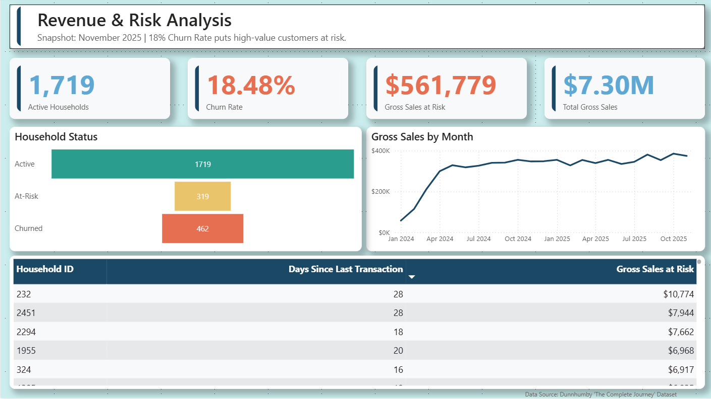
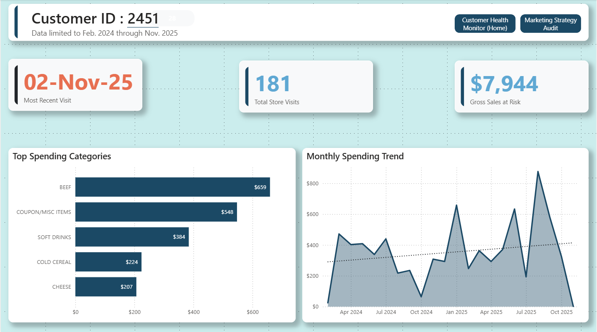
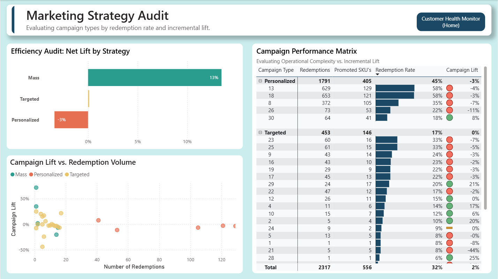

# Loyalty Loop: Customer Lifecycle & Campaign ROI Analytics


> A professional grade portfolio project demonstrating iterative data architecture, strict data governance, and operational analytics using the Dunnhumby dataset.

***

## 1. Executive Summary & Data Governance

A retail grocery chain with 2,500 tracked households and 2.5 million transactions required visibility into customer churn risk and marketing effectiveness but lacked a scalable data architecture to support granular analysis.



**Key Operational Impacts:**

* **Metric Contamination Corrected:** The initial dataset included 25,000 non merchandise administrative rows (Fuel and Loyalty Points). Eradicating these anomalies corrected core metrics like Average Basket Value, which had previously been artificially inflated by approximately 15%.
* **Baseline Establishment:** Established a clean baseline of true Gross Merchandise Value to ensure all subsequent ROI calculations were anchored in actual revenue.

***

## 2. Customer Lifecycle & Churn Analytics

Standard industry practice utilized a reactive 90 day churn definition. By calculating the median Inter Purchase Interval (IPI), I proved the actual biological shopping cycle was 4 days.



**Key Operational Impacts:**

* **Threshold Enforcement:** Implemented a strict 30 Day Churn Threshold based on statistical upper fences.
* **Gross Sales Protection:** This dynamic threshold revealed 346 High Value Households sitting in the critical 15 to 30 day intervention window. This exposed over **$250,000 in annualized Gross Sales** at risk that were entirely hidden by the legacy 90 day metric.
* **Strategic RFM:** Built a custom RFM segmentation model to categorize these households for targeted operational intervention.

***

## 3. Marketing Effectiveness & Campaign ROI

Store operations were executing highly complex personalized campaigns without control group visibility. To determine true incrementality, I applied a Difference in Differences (DiD) control group methodology to compare Target versus Control households.



**Key Operational Impacts:**

* **Mass Marketing Efficiency:** The DiD analysis proved that standard Mass Marketing drove a +14% Net Incremental Lift.
* **Personalization Cannibalization:** Highly complex Personalized Campaigns resulted in a negative net lift. The discounts subsidized purchases that would have occurred naturally, cannibalizing Gross Sales. This provided the mathematical mandate to halt these specific campaigns and reallocate store labor.

### DAX Implementation: DiD Lift Calculation

```dax
// Calculates the Net Incremental Lift comparing Target vs Control groups across two periods
Net_Incremental_Lift = 
VAR TargetPre = CALCULATE([Total Sales], 'Campaign'[Group] = "Target", 'Date'[Period] = "Pre")
VAR TargetPost = CALCULATE([Total Sales], 'Campaign'[Group] = "Target", 'Date'[Period] = "Post")
VAR ControlPre = CALCULATE([Total Sales], 'Campaign'[Group] = "Control", 'Date'[Period] = "Pre")
VAR ControlPost = CALCULATE([Total Sales], 'Campaign'[Group] = "Control", 'Date'[Period] = "Post")

VAR TargetDiff = TargetPost - TargetPre
VAR ControlDiff = ControlPost - ControlPre

RETURN
DIVIDE((TargetDiff - ControlDiff), ControlPre, 0)
```

***

## 4. Presentation Layer & Dashboard Interactivity

The frontend of this solution was engineered to transition raw data into an actionable operational tool for store management. The Power BI report utilizes advanced UI/UX features to manage the 2.5 million row model without overwhelming the end user.

**Core Interactive Features:**

* **Operational Drill Throughs:** The dashboard is not a static reporting tool. Store managers can right click the 'At Risk' segment (the 346 households identified in the 15 to 30 day window) and execute a drill through to a hidden, granular tabular view. This exposes the specific `household_key` identifiers and transaction histories required for targeted intervention.
* **Dynamic UX & Bookmarking:** To prevent visual clutter on the Campaign ROI page, I implemented custom bookmarking and selection panes. This allows users to toggle seamlessly between the Target group and Control group distributions without requiring separate report pages.
* **DAX Driven Conditional Formatting:** Visual cues are strictly automated via DAX logic. The Difference in Differences (DiD) matrix utilizes conditional formatting to instantly flag negative incremental lift (cannibalization) in red, ensuring executive attention is drawn immediately to failing personalized campaigns.
* **Optimized Filter Context:** Because the underlying architecture was refactored into a strict star schema with a `dim_customer_current` table, cross filtering between the Strategic RFM scatter plots and the macro Gross Sales KPIs resolves in sub second render times via the VertiPaq engine.

***

## 5. Data Architecture & Python ETL Pipeline

The initial data pipeline (Version 1.0) attempted to track historical customer status using a monthly snapshot fact table. Upon loading into the presentation layer, this design failed at scale, causing Cartesian products and filter context collisions.

To resolve this, I refactored the Python pipeline to output a strict `dim_customer_current` dimension table based on the absolute maximum transaction date per household.

### Python Implementation: Dimensional Grain Control

```python
import pandas as pd

def build_current_customer_dim(transactions_df):
    """
    Collapses 2.5M transaction rows into a single source of truth 
    dimension table to prevent Cartesian explosions in VertiPaq.
    """
    # Isolate absolute max date per household
    latest_tx = transactions_df.groupby('household_key')['transaction_date'].max().reset_index()
    latest_tx.rename(columns={'transaction_date': 'last_purchase_date'}, inplace=True)
    
    # Calculate days since last purchase for dynamic churn modeling
    analysis_date = transactions_df['transaction_date'].max()
    latest_tx['days_since_prior'] = (analysis_date - latest_tx['last_purchase_date']).dt.days
    
    # Enforce 30 Day Churn Threshold based on median IPI
    latest_tx['status'] = latest_tx['days_since_prior'].apply(
        lambda x: 'Churned' if x > 30 else 'Active'
    )
    
    return latest_tx
```

This architectural pivot optimized the data model, eliminating many to many filter collisions and enabling precise operational drill throughs.

***

## 6. Project Structure & Setup Instructions

Due to GitHub file size constraints, the raw 2.5 million row Dunnhumby dataset is excluded. To run this pipeline locally:

1. Clone the repository and download "The Complete Journey" dataset from Dunnhumby into `data/raw/`.
2. Install dependencies: `pip install pandas numpy matplotlib seaborn jupyter`
3. Execute the Python ETL scripts located in the `/scripts/` directory in numerical order.
4. Review the statistical logic within the Jupyter notebooks located in `/notebooks/`.
5. Open `powerbi/Loyalty_Loop_Dashboard_v2.0.pbix` to review the optimized star schema.

***

## Author

**Jason Donner**

* Data Analytics & Visualization Professional
* Focus: Enterprise Data Architecture, Retail Analytics, System Optimization
